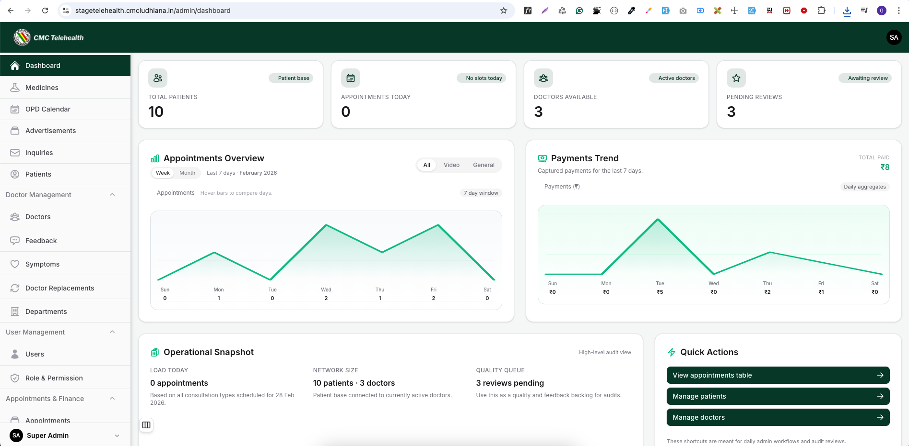

# Telehealth Deploymeta



## Overview

**Telehealth Deploymeta** is a comprehensive telehealth application designed to facilitate remote medical consultations, manage patient records, and handle online payments securely. The platform leverages modern web technologies to provide a seamless experience for doctors, patients, and administrators.

## Features

- **Telehealth Video Consultations:** Integrated with Whereby API for seamless and secure video calling between doctors and patients.
- **Advanced Admin Dashboard:** A powerful and user-friendly administrative interface powered by Filament PHP.
- **Role & Permission Management:** Granular role-based access control built with Spatie Permissions and Filament Shield.
- **Payment Integration:** Secure online transactions processed via Razorpay.
- **Media & File Management:** Efficient handling of medical records and assets using Spatie MediaLibrary.
- **Docker Ready:** Comes with a pre-configured Docker setup (`docker-compose.yml`, `Dockerfile`, and Nginx config) for straightforward local development and deployment.

## Tech Stack

- **Framework:** Laravel (PHP 8.2+)
- **Admin Panel:** Filament PHP v3/v4
- **Database:** MySQL
- **Video Conf:** Whereby API
- **Payments:** Razorpay
- **Environment:** Docker & Docker Compose

## Prerequisites

- [Docker](https://www.docker.com/) and Docker Compose
- [Composer](https://getcomposer.org/) (if running outside Docker)
- [Node.js](https://nodejs.org/) and NPM (for asset compilation)

## Getting Started

Follow these steps to set up the project locally using Docker:

### 1. Clone the repository

```bash
git clone <your-repository-url>
cd filament
```

### 2. Configure Environment Variables

Copy the example environment file and update it with your credentials:

```bash
cp src/.env.example src/.env
```

Make sure to configure your database, Razorpay, and Whereby credentials in the `src/.env` file.

### 3. Build and Start Docker Containers

Start the application services (PHP, MySQL) in the background:

```bash
docker-compose up -d --build
```

### 4. Install Dependencies

Enter the PHP container or run Composer and NPM locally in the `src` directory:

```bash
cd src
composer install
npm install
npm run build
```

_(Note: The `composer.json` includes a handy setup script you can trigger via `composer setup`)_

### 5. Generate Application Key and Run Migrations

```bash
php artisan key:generate
php artisan migrate --seed
```
